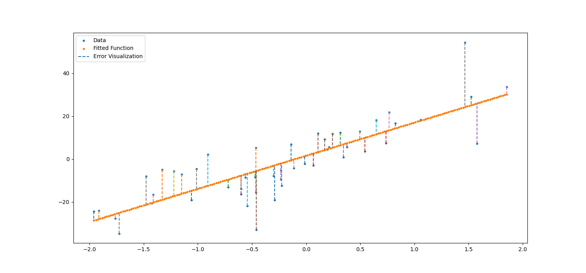
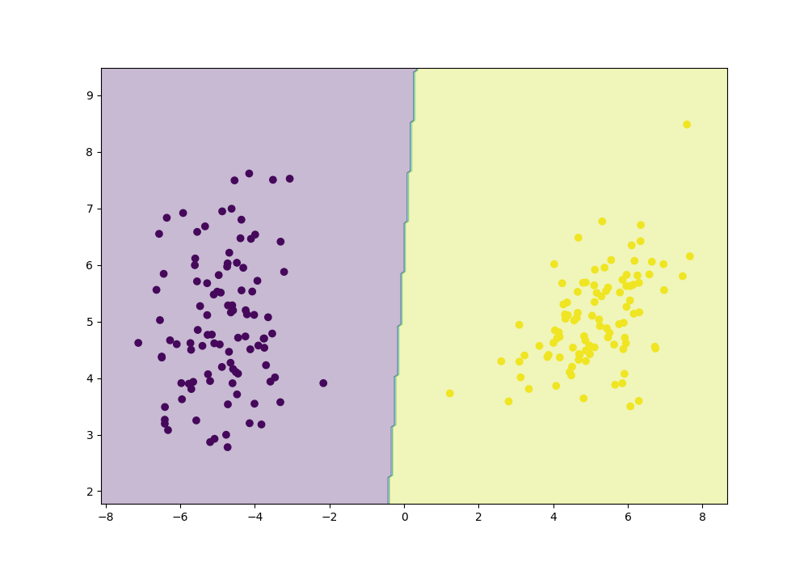
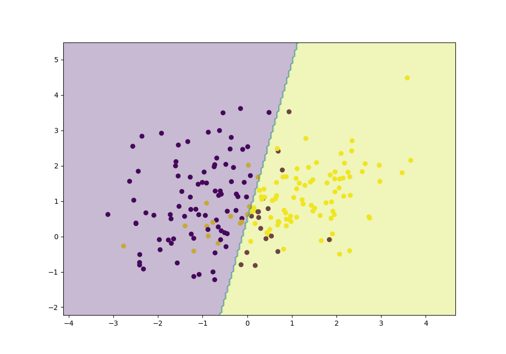

# Cost Functions

In Machine Learning, cost functions are a way to measure how close our model's predictions are to the actual data.  
They guide the optimization process by assigning a numerical value to the "error" of the model. The goal of training is to **minimize** the cost function.

There are many cost functions, depending on the type of task. Here are some of the most important ones, their formulas, and their main uses.

---

## Intuition

Suppose we have the following situation.

Here the orage line is a function and the blue points are the training points. We need to compute how good is this function in regards to the blue points.

Note:

* $\hat{y}_i$ is the predicted value for sample $X_i$
* $y_i$ is the actual value for sample $X_i$
* $N$ is the number of samples

The most simple method would be to avrage the distances from the blue points to the actual line:

\[
\text{Loss} = \frac{1}{N} \cdot \sum_{i=1}^{N} (\hat{y}_i - y_i)
\]

The main problem with his approach is that in some cases (like the example) the loss would become close to $0$, since there are both positive and negative distances present.

To solve this, we could use the absolute value of this values. This loss is called Mean Absolute Error (MAE).

Another solution for the $0$ problem is to square each term. In this way all the elements will be positive and it will penalise the bigger distances more, achieving a more stable training. This method is called Mean Squared Error (MSE).

### Mean Absolute Error (MAE)

**Formula:**

\[
\text{MAE} = \frac{1}{N} \sum_{i=1}^{N} |\hat{y}_i - y_i|
\]

**Use:** Regression tasks  
**Notes:**  
- Less sensitive to outliers than MSE  
- Gradient is not smooth at zero → may be harder to optimize with Gradient Descent

---

### Mean Squared Error (MSE)

**Formula:**

\[
\text{MSE} = \frac{1}{N} \sum_{i=1}^{N} (\hat{y}_i - y_i)^2
\]

**Use:** Regression tasks  
**Notes:**  
- Penalizes large errors more than small ones  
- Smooth and differentiable → works well with Gradient Descent

---

## Classification

All the above functions are used in regression tasks. For a classification task they would not work, since the relative distance from the points to the decision boundry is constant, we need to see how well the model splited the dataset.

Suppose we have this dataset.

Our goal is to find the decision boundry (blue line) between the violet and yellow dots. To do this we can find a function $f$ and the predicted label be $sgn(f(x))$. 

In order to find this function we need a method to judge how good a separation is. One simple method is zero-one loss. This loss function calculates how many points were missclassified. 

\[
L_\text{zero-one} = \frac{\text{No. of wrong predictions}}{\text{Total predictions}}
\]

In this case $L_\text{zero-one}$ is $0$, since all the points are separated clearly.

Let's look at another dataset.

Here the points are not linearly separable, so the zero-one loss is $0.16$ so about $16%$ of the data was missclassified.

The main problem of this loss is that it is **NOT** differantiable since its formula does not contain $y$ and $\hat{y}$ so Gradient Descent can not optimize the function. 

### Cross Entropy Loss

In order to solve this, the most used classification loss function is Cross Entropy Loss (aka. Log Loss). 

\[
\text{Log Loss} = -(y \cdot \log(p) + (1 - y) \cdot \log(1 - p))    
\]

Where:

* $y$ is the true label
* $p$ is the probability predicted by the model of the sample $X_i$ to belong to class $1$

Intuitevely, if the sample $X_i$ belongs to class $1$ then to the loss its added $-\log(p)$, and if the sample belongs to $0$ then we add $-\log(1 - p)$. 

This method assures that the points are classified to the correct class, with maximum confidence. 

If the confidance is high (close to $1$) then $-log(p)$ is close to $0$. If the confidance is low (close to $0$) then $-log(p)$ is high. 

Example:

| True label (y) | Predicted probability (p) | Log Loss |
|----------------|--------------------------|----------|
| 1              | 0.9                      | 0.105    |
| 1              | 0.6                      | 0.511    |
| 1              | 0.1                      | 2.302    |
| 0              | 0.1                      | 0.105    |
| 0              | 0.4                      | 0.511    |
| 0              | 0.9                      | 2.302    |
